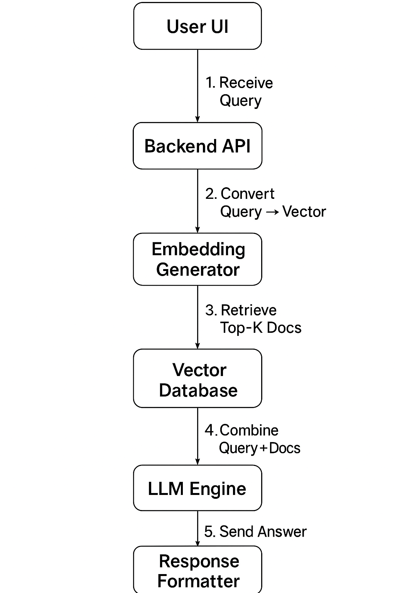
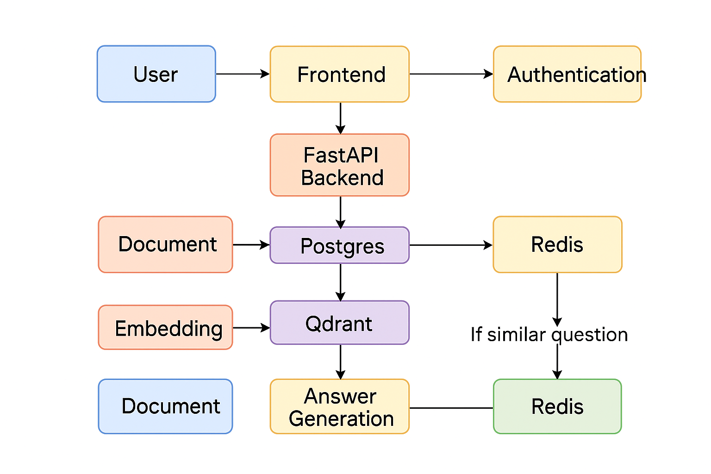

# RAG Knowledge Retrieval System

## Overview

This project is a **Retrieval-Augmented Generation (RAG) system** that allows users to upload documents, store their content in a vector database, and ask questions about the documents. Answers are generated using a large language model (LLM) grounded in the document content, with citations included.  

The system demonstrates a **full end-to-end workflow** from document ingestion to answer generation with caching and multi-tenant support.

---

## Features

- **Document Ingestion:** Upload PDFs or provide URLs. Extracts text and stores metadata in Postgres.  
- **Vector Indexing:** Generates embeddings for document chunks and stores them in Qdrant.  
- **Query & Retrieval:** Searches Qdrant for relevant document chunks based on user queries.  
- **Answer Generation:** Uses an LLM (OpenAI GPT or Claude) to answer questions grounded in retrieved documents.  
- **Caching:** Redis caches frequent queries and generated answers for faster performance.  
- **Authentication & Multi-Tenancy:** Users log in via Google OAuth. Data is scoped per tenant.  
- **Minimal Frontend:** Web interface for document upload and chat-style querying.  
- **Production-Ready Setup:** Docker Compose configuration for all services.

---

## Tech Stack

- **Backend:** FastAPI  
- **Database:** PostgreSQL + SQLAlchemy + Alembic  
- **Caching:** Redis  
- **Vector Database:** Qdrant  
- **Authentication:** Google OAuth 2.0  
- **LLM Integration:** OpenAI  
- **Frontend:** React  
- **Containerization:** Docker + Docker Compose  

---

## Architecture


**Workflow:**

1. User uploads a document → stored in Postgres, processed for text extraction → embedded and indexed in Qdrant.  
2. User asks a question → query embedded → relevant chunks retrieved from Qdrant → answer generated using LLM.  
3. Result returned with **citations** from the original documents.  
4. Query + answer cached in Redis for future requests.

---

## Setup Instructions

### Prerequisites

- Python 3.11+  
- Docker & Docker Compose  
- Node.js & npm/yarn (for frontend)  
- Access to OpenAI  API key  

### Backend Setup

1. Clone the repository:

```bash
git clone <repo-url>
cd <repo-folder>
```

### 2. Create a `.env` File

Create a `.env` file based on `.env.example`:

```env
OPENAI_API_KEY=your-openai-key
QDRANT_URL=http://localhost:6333
QDRANT_API_KEY=
COLLECTION_NAME=documents
GOOGLE_CLIENT_ID=your-google-client-id
GOOGLE_CLIENT_SECRET=your-google-client-secret
SESSION_SECRET=your-session-secret
SERVER_URL=http://localhost:8000
SECRET_KEY=your-jose-secret
ALGORITHM=HS256
```
### 3. Install Python Dependencies

```bash
pip install -r requirements.txt
```
### 4. Run Database Migrations

```bash
alembic upgrade head
```

### 5.Start the Backend

```bash
uvicorn app.main:app --reload --port 8000
```

## Frontend Setup (optional)

### 1.Navigate to the frontend folder:

```bash
cd frontend
npm install
npm run dev
```
### Docker Compose

To run all services together (Postgres, Redis, Qdrant, Backend):
```bash
docker-compose up --build
```

## API Endpoints

| Method | Endpoint | Description |
|--------|---------|-------------|
| POST   | `/upload_pdf/` | Upload PDF and index document |
| POST   | `/ask/` | Ask a question, returns answer with sources |
| GET    | `/login` | Redirect to Google OAuth login |
| GET    | `/auth/google/secrets` | OAuth callback |
| GET    | `/me` | Get logged-in user info |

### License

MIT License
